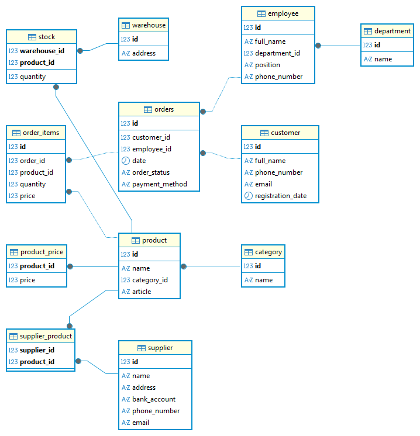

# Electronics Store Database


A portfolio project demonstrating the design and implementation of a relational database for an electronics retail store using PostgreSQL.

---

# Project Overview

This project simulates the database of a modern electronics store. It was developed to demonstrate practical SQL skills, relational database design principles, and the implementation of realistic business logic.

Unlike a simplified academic example, the database models real-world relationships between customers, employees, suppliers, products, warehouses, orders, inventory, and pricing.

The project focuses on:

- normalized database design;
- data integrity;
- business-oriented SQL queries;
- analytical reporting;
- PostgreSQL best practices.

---

# Database Features

- Relational database design
- Normalized schema
- Primary Keys
- Foreign Keys
- Composite Primary Keys
- CHECK constraints
- UNIQUE constraints
- NOT NULL constraints
- Indexes for query optimization
- Realistic sample dataset

---

# Database Structure

The database contains the following entities:

| Table | Description |
|--------|-------------|
| customer | Store customers |
| employee | Store employees |
| department | Company departments |
| supplier | Product suppliers |
| supplier_product | Supplier-product relationships |
| product | Product catalog |
| category | Product categories |
| product_price | Current product prices |
| warehouse | Warehouses |
| stock | Product inventory |
| orders | Customer orders |
| order_items | Products included in each order |

---

# Entity Relationship Diagram

The complete database schema is shown below.



---

# Repository Structure

```
electronics-store-db
│
├── database
│   ├── schema.sql
│   └── seed.sql
│
├── diagram
│   └── erd.png
│
├── queries
│   ├── basic_queries.sql
│   ├── join_queries.sql
│   ├── aggregate_queries.sql
│   └── advanced_queries.sql
│
├── screenshots
│
├── README.md
├── LICENSE
└── .gitignore
```

---

# SQL Features Demonstrated

The project demonstrates the use of:

- SELECT
- WHERE
- ORDER BY
- GROUP BY
- HAVING
- INNER JOIN
- Aggregate Functions
- Common Table Expressions (WITH)
- Window Functions (RANK, LAG)
- EXISTS
- Subqueries
- Indexes

---

# Example Business Queries

The repository contains SQL scripts solving practical business tasks.

Examples include:

- calculating total order cost;
- finding newly registered customers;
- displaying the most expensive products;
- analyzing order statuses;
- identifying products with low stock levels;
- evaluating employee performance;
- calculating revenue over a six-month period;
- finding customers with incomplete orders;
- determining the best-selling product category;
- generating a complete order report;
- analyzing monthly revenue trends;
- finding suppliers that provide laptops.

Selected query results are available in the **screenshots** directory.

---

# Example SQL

## Top 5 Most Expensive Products

```sql
SELECT
    p.id,
    p.name,
    pp.price
FROM product p
JOIN product_price pp
    ON p.id = pp.product_id
ORDER BY pp.price DESC
LIMIT 5;
```

---

## Monthly Revenue Analysis

```sql
WITH monthly_sales AS
(
    SELECT
        DATE_TRUNC('month', o.date) AS month,
        SUM(oi.quantity * oi.price) AS revenue
    FROM orders o
    JOIN order_items oi
        ON o.id = oi.order_id
    WHERE o.order_status IN ('оплачен', 'выдан')
    GROUP BY DATE_TRUNC('month', o.date)
)

SELECT
    month,
    revenue,
    LAG(revenue)
        OVER (ORDER BY month) AS previous_month,
    revenue -
    LAG(revenue)
        OVER (ORDER BY month) AS revenue_difference
FROM monthly_sales
ORDER BY month;
```

---

## Suppliers Providing Laptop Products

```sql
SELECT
    s.name
FROM supplier s
WHERE EXISTS
(
    SELECT 1
    FROM supplier_product sp
    JOIN product p
        ON p.id = sp.product_id
    JOIN category c
        ON c.id = p.category_id
    WHERE
        sp.supplier_id = s.id
        AND c.name = 'Ноутбуки'
);
```

---

# Technologies

- PostgreSQL
- SQL
- DBeaver
- Git
- GitHub

---

# How to Run

### 1. Clone the repository

```bash
git clone https://github.com/your_username/electronics-store-db.git
```

### 2. Create a PostgreSQL database

```sql
CREATE DATABASE electronics_store;
```

### 3. Execute the schema

```text
database/schema.sql
```

### 4. Populate the database

```text
database/seed.sql
```

### 5. Run any query from

```
queries/
```

---

# Learning Objectives

This project was created to strengthen practical skills in:

- relational database design;
- normalization;
- SQL query development;
- analytical SQL;
- PostgreSQL database development;
- query optimization using indexes.

---

# Future Improvements

Potential future enhancements include:

- price history table;
- purchase orders from suppliers;
- product returns;
- customer loyalty program;
- views;
- stored procedures;
- triggers;
- role-based access control.

---

# Author Pyotr Batalov

Portfolio project created for learning SQL, PostgreSQL, and relational database design.
